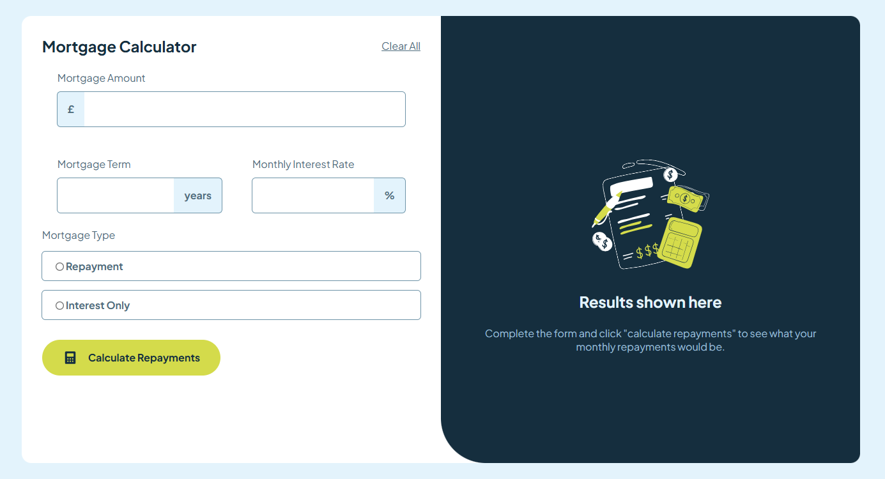

# Frontend Mentor - Mortgage repayment calculator solution

This is a solution to the [Mortgage repayment calculator challenge on Frontend Mentor](https://www.frontendmentor.io/challenges/mortgage-repayment-calculator-Galx1LXK73). Frontend Mentor challenges help you improve your coding skills by building realistic projects. 

## Table of contents

- [Frontend Mentor - QR code component solution](#frontend-mentor---qr-code-compon-solution)
  - [Table of contents](#table-of-contents)
  - [Overview](#overview)
    - [The challenge](#the-challenge)
    - [Screenshot](#screenshot)
    - [Links](#links)
  - [My process](#my-process)
    - [Built with](#built-with)
  - [Author](#author)
  - [Acknowledgments](#acknowledgments)**

## Overview

### The challenge

Users should be able to:

- Input mortgage information and see monthly repayment and total repayment amounts after submitting the form
- See form validation messages if any field is incomplete
- Complete the form only using their keyboard
- View the optimal layout for the interface depending on their device's screen size
- See hover and focus states for all interactive elements on the page

### Screenshot

### Links

- Solution URL: [GitHub repo](https://github.com/vVvOvOvVv/mortgage-repayment-calculator)
- Live Site URL: [https://v-mortgage-calculator.netlify.app](https://v-mortgage-calculator.netlify.app)

## My process

### Built with

- [Vue.js](https://vuejs.org) (Options API)
- [npm](https://www.npmjs.com)
- HTML
## Author

- Dev Portfolio & Website - [V's Portfolio](https://vvvovovvv.github.io)

## Acknowledgments

Resources and assets used in this project were provided by [Frontend Mentor](https://www.frontendmentor.io/challenges/browser-extension-manager-ui-yNZnOfsMAp). This is otherwise a solo project.